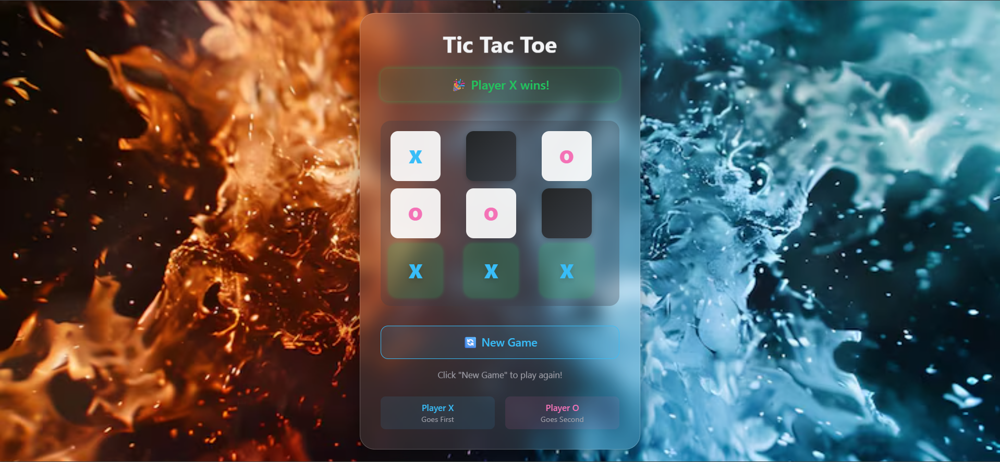

# Tic-Tac-Toe

A classic Tic Tac Toe (X & O) game built with **React** and **Tailwind CSS**.

## Features

- **2-Player Mode:** Play locally with a friend.
- **Modern UI:** Glassmorphic game board with a beautiful background image.
- **Responsive Design:** Works great on desktop and mobile.
- **Win Detection:** Instantly highlights the winning line and announces the winner.
- **Draw Detection:** Detects and announces draws.
- **Smooth Animations:** Subtle transitions and effects for a polished experience.
- **Restart Option:** Quickly start a new game with a single click.

## Screenshots



## Getting Started

1. **Clone the repository:**
   ```sh
   git clone https://github.com/1408Keshu/Tic-Tac-Toe.git
   cd Tic-Tac-Toe
   ```

2. **Install dependencies:**
   ```sh
   npm install
   ```

3. **Start the development server:**
   ```sh
   npm run dev
   ```

4. Open [http://localhost:5173](http://localhost:5173) in your browser.

## Project Structure

```
src/
  component/
    TicTacToe.jsx   # Main game component
  index.css         # Tailwind and custom styles
  App.jsx           # App entry point
public/
  ...               # Static assets (background image, etc.)
```

## Customization

- **Background Image:** Replace the image in the `public` folder to use your own background.
- **Styling:** Modify `index.css` or use Tailwind classes to further customize the look.

## Built With

- [React](https://react.dev/)
- [Vite](https://vitejs.dev/)
- [Tailwind CSS](https://tailwindcss.com/)

## License

This project is open source and available under the [MIT License](LICENSE).
